# Сервис адаптации сотрудников

Сервис помогает новым сотрудникам войти в рабочий ритм, встроиться в команду и познакомиться с основным сайтом или приложением организации в течение 1–3 месяцев — в зависимости от объёма квестов.

## Демо

Запуск сервиса: <https://ulyanachir.github.io/fornaumen/code/index.html>

Рекомендуется также ознакомиться с макетами сервиса в разделе [«Приложение: макеты»](#приложение-макеты).

## Назначение сервиса

Сервис предназначен для адаптации сотрудников через систему квестов, этапов и заданий.

Сервис **не предполагает**:

- хранение документации организации;
- активное общение и рабочие чаты, кроме адаптационных ситуаций.

## Роли и доступы

Сервис работает с двумя ролями: **куратор** и **курируемый сотрудник**.

| Роль | Логин | Пароль |
| --- | --- | --- |
| Курируемый сотрудник | `worker` | `worker` |
| Куратор | `supervisor` | `supervisor` |

Безопасность реализована через создание аккаунта новым сотрудникам: куратор создаёт аккаунт сотрудника и выдаёт ему логин и пароль. Подробнее см. раздел [«Добавление сотрудника»](#3-добавление-сотрудника).

## Общие особенности реализации

- Кнопка **«Мой профиль»** работает из любого окна.
- На текущем этапе реализации **«Справочник сотрудников»** доступен в меню только:
  - с панели **«Главное меню куратора»** для роли `supervisor`;
  - с панели квеста курируемого сотрудника для роли `worker`.
- При тех же условиях работает кнопка **«Выйти»**.

## Главное меню куратора

Из панели **«Главное меню куратора»** можно перейти во все разделы, являющиеся прототипами с ограниченным функционалом.

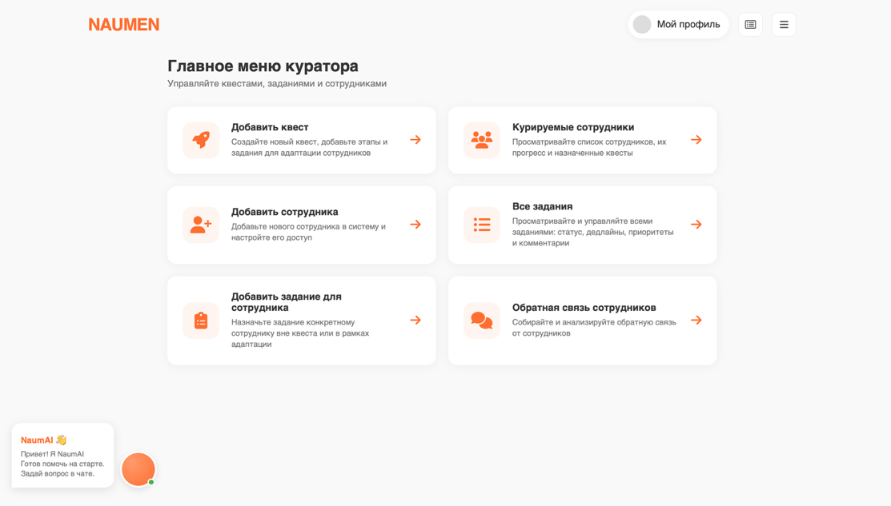

## Конструктор квестов

В разделе **«Добавить квест»** показан функционал создания квеста. Подробнее о создании заданий для этапа см. раздел [«Создание задания для этапа»](#9-создание-задания-для-этапа).

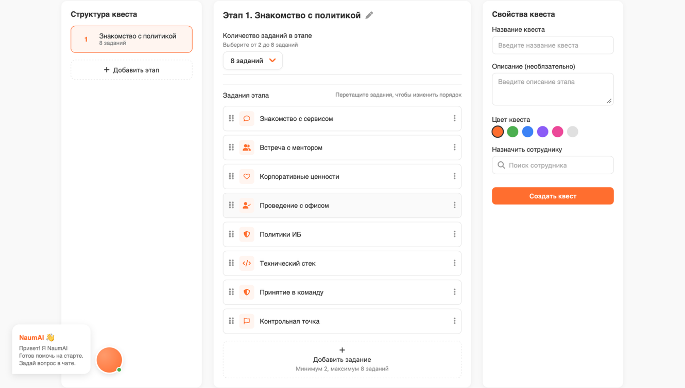

На сервисе есть возможность выдавать персональные задания, не связанные с квестом. Также можно выдать эти задания всем сотрудникам, проходящим определённый квест. Подробнее см. раздел [«Создание задания»](#7-создание-задания).

## Этапы и задания

Этап включает от 2 до 8 заданий. Любое задание можно пометить как контрольную точку, которую необходимо сдать в короткий срок и получить подтверждение куратора о качественном выполнении.

### Шаблоны возможных заданий

#### 1. Запись видео-ответа

**Суть:** новичок записывает короткое видео до 2 минут на камеру ноутбука или телефона.

**Поля в конструкторе:**

- текст задания;
- максимальная длительность видео: 30 секунд, 1 минута, 2 минуты или 5 минут;
- поле для комментария для сотрудника.

#### 2. Прикрепление файла с проверкой расширения

**Суть:** сотрудник загружает документ: PDF, Excel, скриншот, Figma-ссылку и т. д.

**Примеры:**

- «Прикрепи подписанный договор»;
- «Найди на сайте организации шаблон документа».

**Поля в конструкторе:**

- текст задания;
- допустимые форматы: `.pdf`, `.docx`, `.xlsx`, `.png`, `.jpg`, `.txt`;
- максимальный размер файла: 5 MB, 10 MB или 25 MB;
- кто проверяет: наставник или автоматически.

#### 3. Выполнение в среде

**Суть:** сотрудник создаёт или завершает задачу во внешней системе. Сервис проверяет через API, выполнена ли задача.

**Пример:** «Создай тикет в проекте IT-поддержки с просьбой выдать доступ к базе».

**Поля в конструкторе:**

- выбор интеграции: Jira, Trello, Asana или Yandex Tracker;
- ID проекта или доски;
- тип проверки: задача создана или задача переведена в `Done`;
- период ожидания: часы или дни, в течение которых сервис ожидает проверку.

#### 4. Скан QR-кода с физического места

**Суть:** новичок подходит к конкретному месту в офисе — например, к серверной, складу или столу наставника — и сканирует QR-код камерой сервиса.

**Пример:** «Подойди к стойке ресепшн, отсканируй QR и получи достижение “Ориентация пройдена”».

**Поля в конструкторе:**

- кнопка генерации уникального QR-кода;
- привязка к локации, например: «Серверная, 3-й этаж».

#### 5. Отметка о встрече с конкретным коллегой

**Суть:** новичок выбирает человека из справочника или получает указание встретиться с конкретным сотрудником. После встречи или созвона он подтверждает выполнение. При необходимости можно запросить подтверждение от другого сотрудника.

**Поля в конструкторе:**

- выбор сотрудника из справочника или указание конкретного сотрудника;
- способ подтверждения:
  - только отметка новичка;
  - подтверждение выбранного сотрудника через уведомление;
- обязательность встречи;
- дедлайн.

#### 6. Голосование или выбор варианта

**Суть:** сотрудник выбирает один или несколько вариантов ответа, как в опросе.

**Поля в конструкторе:**

- текст вопроса;
- варианты ответов с возможностью добавления, удаления и отметки правильного варианта звёздочкой;
- выбор одного или нескольких правильных ответов;
- настройка показа правильного ответа после выбора.

#### 7. Задача с таймером ожидания

**Суть:** новичок нажимает **«Начать»**, после чего задание становится доступным только через N дней или часов. Также возможен сценарий, при котором сотрудник должен вернуться и подтвердить, что прошло заданное время.

**Пример:** «Через 2 дня после начала работы напиши, какую первую задачу ты закрыл».

**Поля в конструкторе:**

- текст задания до таймера;
- тип таймера:
  - задержка старта: задание показывается через X часов или дней;
  - обязательная задержка перед подтверждением, например: «Поработай с системой 3 дня → потом ответь на вопросы»;
- величина таймера: число и единица измерения — часы или дни.

#### 8. Сопоставление понятий

**Суть:** сотрудник расставляет пары: «Отдел → Руководитель», «Термин → Определение», «Правило → Санкция».

**Пример:** сопоставить имена и лица.

**Поля в конструкторе:**

- левая колонка с элементами;
- правая колонка с элементами;
- настройка перемешивания вариантов при показе;
- критерий успеха: все пары верны или допускается N ошибок;
- настройка показа правильных ответов в конце.

## Иерархия квеста

Квест состоит из этапов, а каждый этап — из заданий.

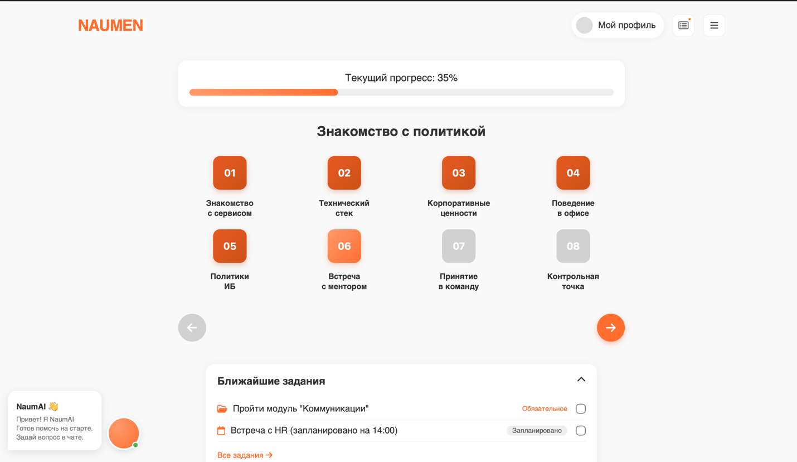

К просмотру прототипа задания доступно задание **06**, этап **«Знакомство с политикой»**.

## Дополнительные прототипы

В сервисе также предусмотрены:

- раздел анализа обратной связи — прототип **«Обратная связь сотрудников»**;
- **«Структура подчинения»** в профиле обеих ролей, где представлена команда пользователя в организации;
- прототип модуля уведомлений, доступный только из окна-квеста;
- уведомление о еженедельном опросе с переходом на короткую форму опроса;
- прототип ассистента, который может ответить на ограниченное количество вопросов.

Для активации ассистента нужно нажать на иконку бота. Ассистент доступен только из окна-квеста сотрудника и главного окна куратора.

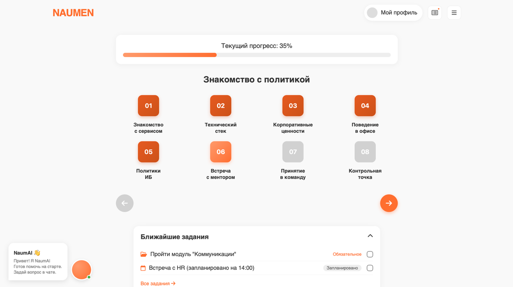

## Приложение: макеты

### 1. Вход в сервис

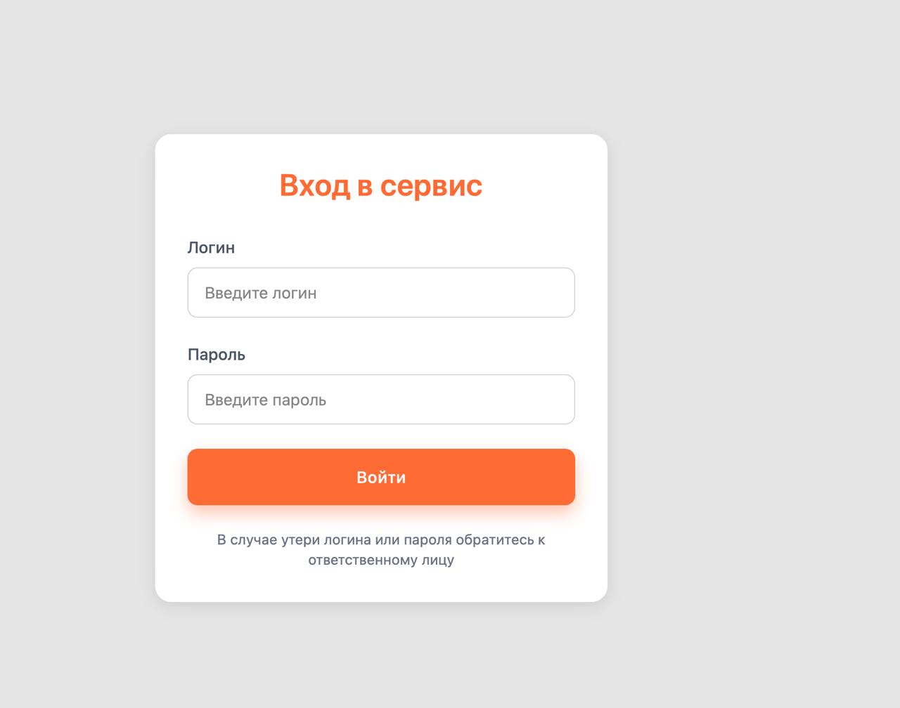

### 2. Главное меню куратора

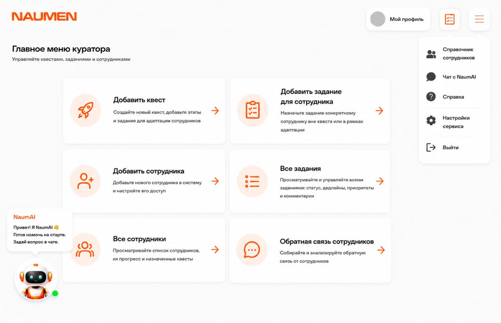

### 3. Добавление сотрудника

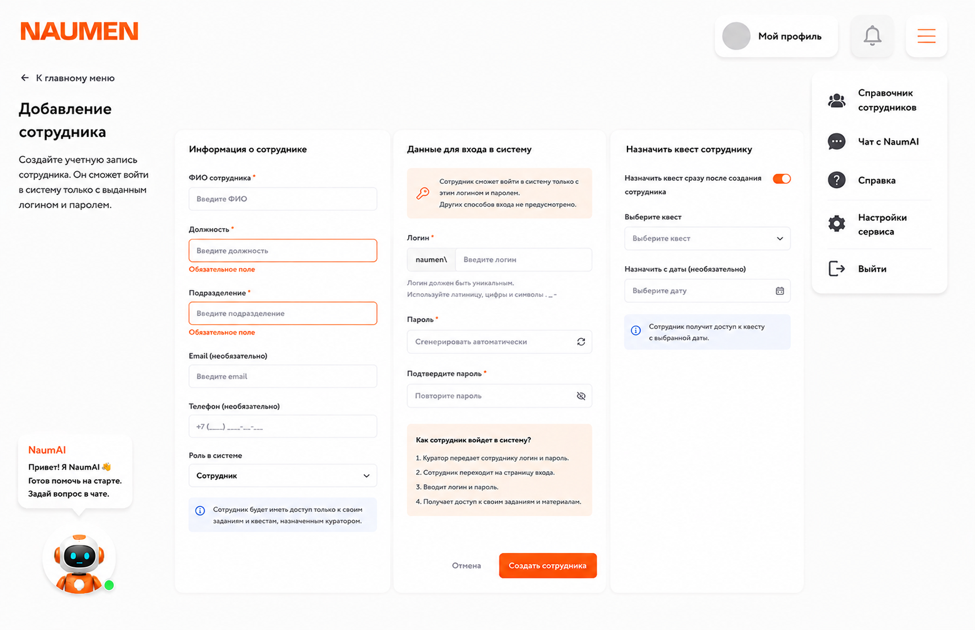

### 4. Все назначенные задания

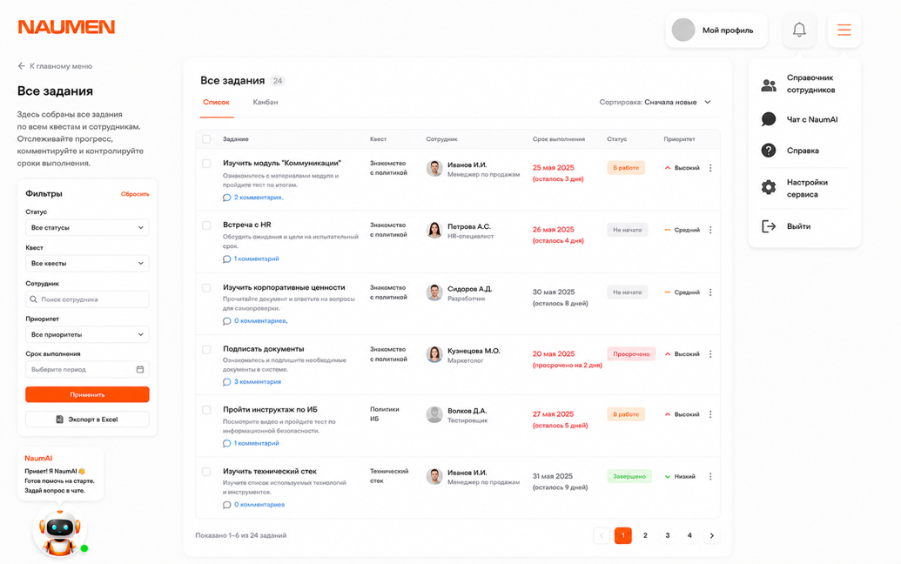

### 5. Все сотрудники

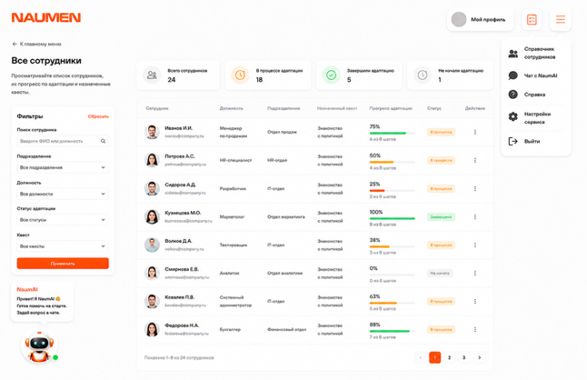

### 6. Просмотр задач конкретного сотрудника

Предполагалась возможность куратора заходить из списка всех сотрудников в карточку конкретного сотрудника и просматривать его задачи.

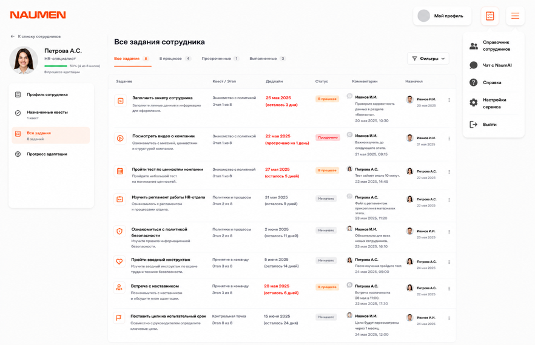

### 7. Создание задания

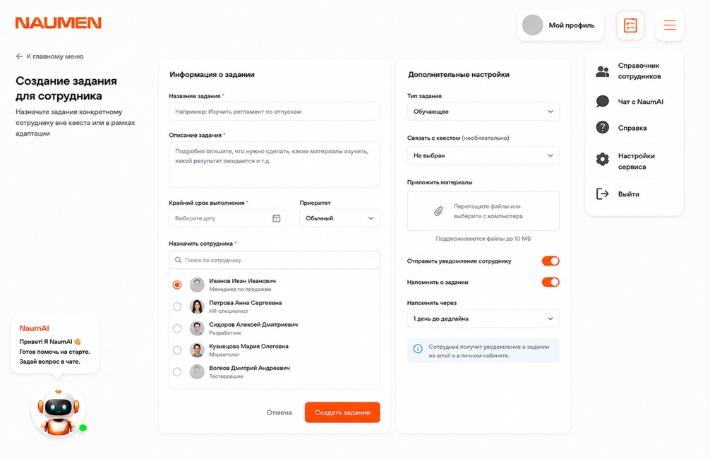

### 8. Конструктор квеста

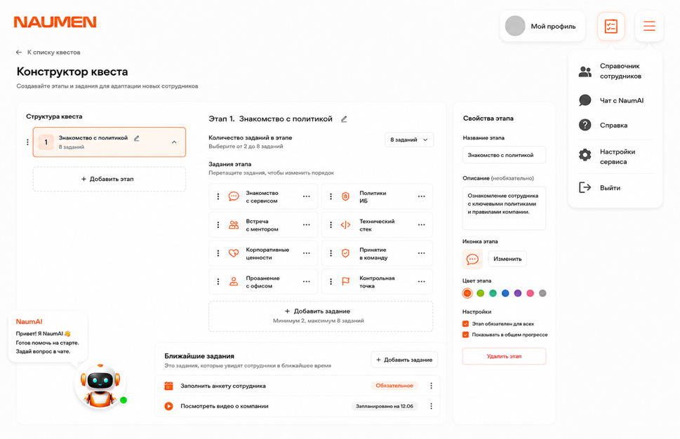

### 9. Создание задания для этапа

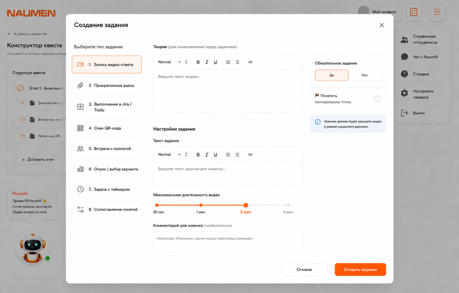

### 10. Обратная связь сотрудников

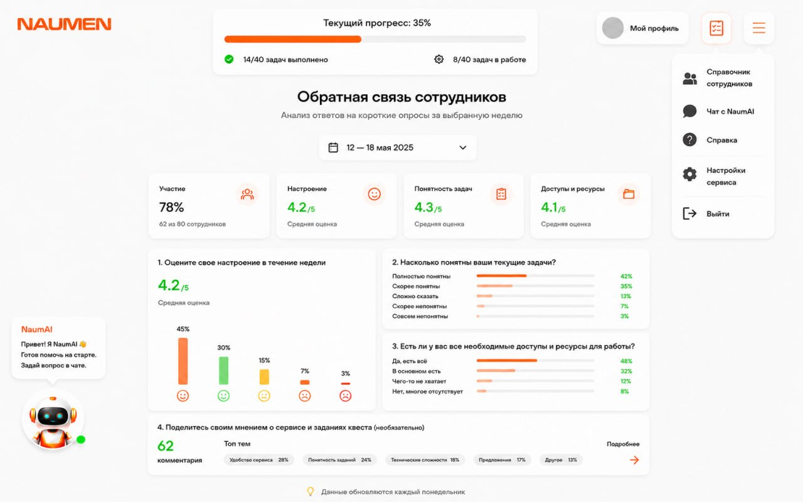

### 11. Окно-квест адаптирующегося сотрудника

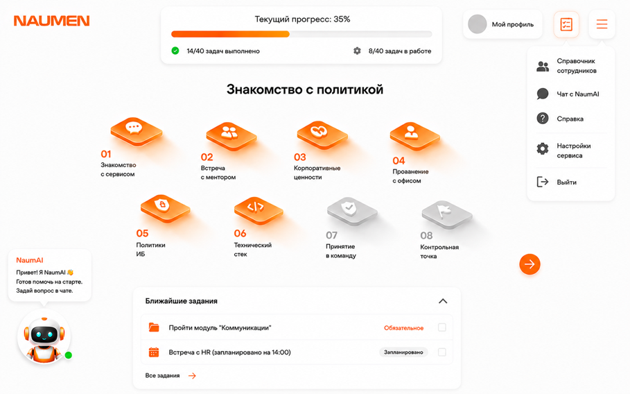

### 12. Все задания сотрудника

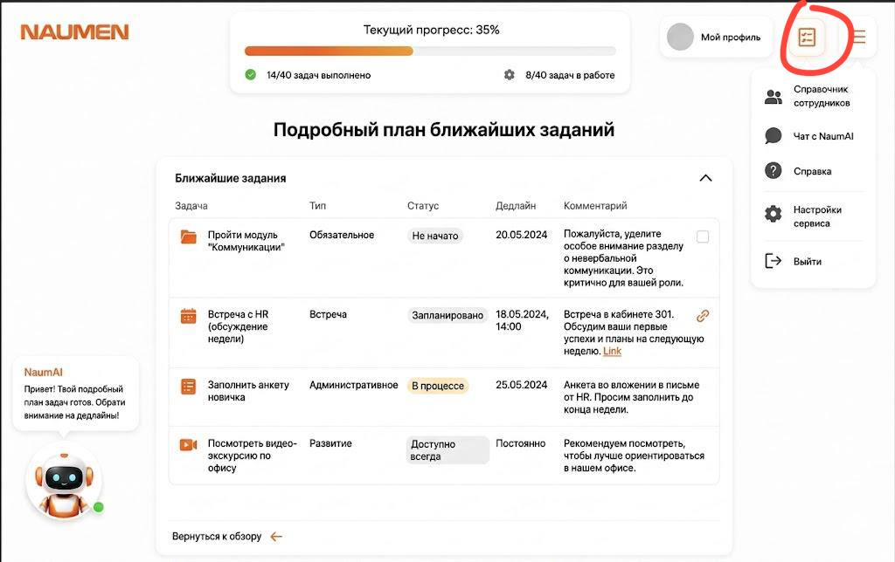

### 13. Окно сбора обратной информации

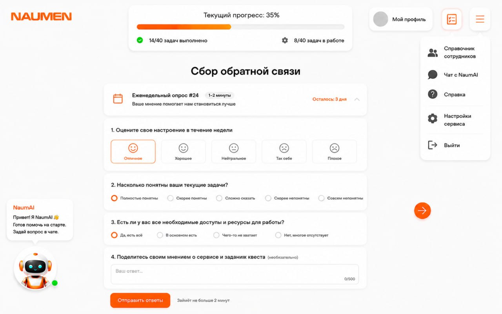

### 14. Справочник сотрудников

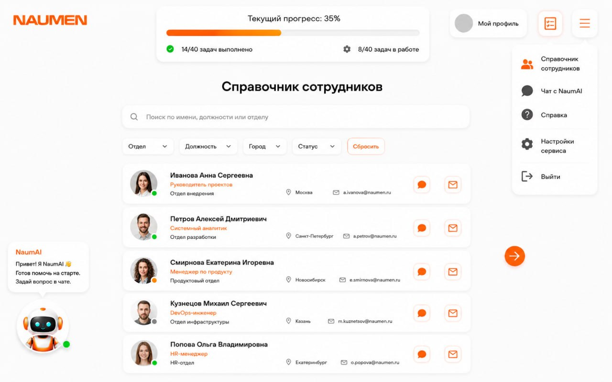
